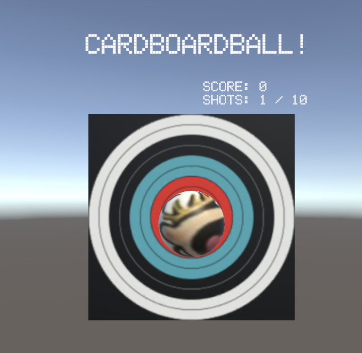

  This is CardboardBall!

  

The game is pretty simple: you press the button to shoot a ball from your eye-line and try to hit the target. Every time you hit the target, it will move a little bit so you can't get the same score just by standing in the same place. You can shoot 10 balls to get the highest possible score, and the closer the ball is to the center of the target, the higher your score. 

I believe this is a game because there are set rules and a goal to achieve the highest possible score. The score is an endogenous value that players can use to compete with one another. I didn't add a leaderboard since writing names with the one-button input system of Cardboard would have been a hassle, but in hindsight, a "High Score" visual would have been elegant and simple.

It is very easy to hit the target thanks to the current settings I have for the ball's speed but getting a high score is tricky, especially because the target moves. Without the target moving, there would not be any real stimulus to the game once the player hits the bullseye one time on a static target. They can just stand still and eventually hit it again. 

Randomized variation like this is a historically good way to maintain engagement. Video games in the "Roguelike" genre such as _Hades_ and _Risk of Rain_ are defined by their randomized levels that make every playthrough unique, and classic "runner" phone games like _Subway Surfers_ and _Temple Run_ procedurally generate their levels for endlessly fresh gameplay. 

I also changed the ball to have a new material to pay homage to [Calvinball]([url](https://calvinandhobbes.fandom.com/wiki/Calvinball)), the best game about a ball: 

  

